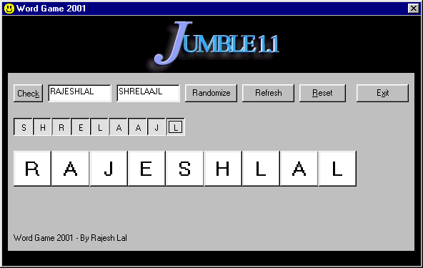



## A Jumble Word Game

### Description

Make your own

"Jumble word game "

as we see in news paper
 
### More Info
 
Input from a table of words you can add your word as convenient

DAO 3.6 is taken for Win 2000

can be changed for Win 95 and 98.

Dynamically created checkbox with

style graphivcal are taken,

and Randomize function exploited

to implement the game

Give a randomely selected word from the table

in a jumble fachion

Each time the program will give a new set of jumble word for the same word

             |
---                |---
**Submitted On**   |2001-04-03 05:35:52
**By**             |[Tomblue](https://github.com/Planet-Source-Code/PSCIndex/blob/master/ByAuthor/tomblue.md)
**Level**          |Advanced
**User Rating**    |4.8 (19 globes from 4 users)
**Compatibility**  |VB 6\.0
**Category**       |[Games](https://github.com/Planet-Source-Code/PSCIndex/blob/master/ByCategory/games__1-38.md)
**World**          |[Visual Basic](https://github.com/Planet-Source-Code/PSCIndex/blob/master/ByWorld/visual-basic.md)
**Archive File**   |[Jumble Wor17855432001\.zip](https://github.com/Planet-Source-Code/tomblue-a-jumble-word-game__1-22108/archive/master.zip)

### API Declarations

see the zip code

